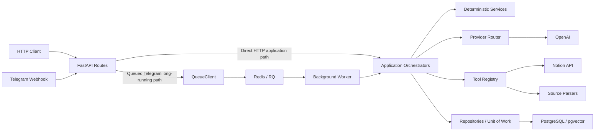

# LearnLoop Agent


> A local-first AI knowledge workflow that turns learning materials into
> reviewable, reusable Notion knowledge.

LearnLoop Agent is a Notion-centered learning agent. It grounds AI supplements
in external material, requires human approval, and appends accepted knowledge
only to Notion's `AI Supplement Zone`. Re-indexing then makes it available to
grounded QA.

```text
Learning Sources
  → Content Extraction
  → Grounded Proposal
  → Human Review
  → Append-only Notion Update
  → Page Re-indexing
  → Reusable Knowledge for QA
```

The product boundary is the knowledge lifecycle—not just an LLM call or a chat
interface. LearnLoop manages how external material becomes durable, traceable,
and user-controlled knowledge.

## Demo

<!--
Add a GIF or a compact screenshot sequence showing:
Telegram upload → target selection → proposal preview → human accept
→ Notion AI Supplement Zone → grounded QA citation
-->

## Why LearnLoop

Learning material is scattered across PDFs, web pages, YouTube transcripts,
screenshots, and chat messages. Manual organization requires repeated reading,
summarizing, classifying, and copying. A chatbot may answer a question, but it
does not govern how a source becomes trusted long-term knowledge.

Allowing an LLM to modify original notes directly can overwrite user work,
duplicate updates, pollute retrieval, and obscure what changed. LearnLoop
separates proposal generation from persistence, while deterministic backend
logic controls review, write policy, identity, re-indexing, and RAG eligibility.

## Product Highlights

| Capability                            | Product value                                                                                                                            |
| ------------------------------------- | ---------------------------------------------------------------------------------------------------------------------------------------- |
| **End-to-end knowledge lifecycle**    | Connects ingestion, normalization, proposal generation, review, append, re-indexing, and QA in one traceable workflow.                   |
| **Multi-source ingestion**            | Accepts PDFs, URLs, YouTube transcripts, screenshot OCR, and pasted chat text.                                                           |
| **Grounded RAG QA**                   | Retrieves eligible indexed Notion chunks through pgvector cosine search or a deterministic lexical fallback, with Notion path citations. |
| **Human-governed updates**            | Persists AI output as a pending change request and requires an explicit human decision before writing.                                   |
| **Append-only knowledge boundary**    | Preserves original notes and old supplement blocks while identifying accepted additions with `change-request-<id>`.                      |
| **Reliable background processing**    | Moves OCR and LLM workloads to Redis/RQ workers while preserving durable workflow and idempotency state.                                 |
| **Extensible integration boundaries** | Isolates LLM providers, Notion, parsers, queues, and persistence behind stable application interfaces.                                   |

## Design Focus

LearnLoop complements general-purpose workspace assistants by focusing on one
specific problem: governing how external learning material becomes persistent,
reviewed knowledge.

| Focus               | LearnLoop approach                                                                                                                               |
| ------------------- | ------------------------------------------------------------------------------------------------------------------------------------------------ |
| Source intake       | Ingest external learning material through bounded source adapters.                                                                               |
| Persistence         | Generate a proposal first, then require a human-reviewed append.                                                                                 |
| Knowledge lifecycle | Re-index accepted updates before making them available to QA.                                                                                    |
| System ownership    | Keep permissions, validation, retrieval eligibility, and state transitions in deterministic backend code rather than delegating them to the LLM. |

## Core Workflows

### Knowledge indexing and QA

```text
Notion Pages
  → Read-only Indexing
  → Section-aware Chunking and Embedding
  → PostgreSQL / pgvector Index

User Question
  → Query Embedding
  → Scoped Retrieval
  → Grounded Answer
  → Notion Path Citations
```

QA uses source and knowledge-state filters before retrieval. When vector search
is unavailable or unusable, it falls back to deterministic lexical retrieval
over the same eligible Notion scope.

### Learning source ingestion

```text
PDF / URL / YouTube / Screenshots / Chat Text
  → Parse and Normalize
  → Persist Source Snapshot and Content Hash
  → Generate Grounded Proposal
  → Pending Human Review
```

Adapters enforce source limits before extraction or OCR. Proposal generation
creates workflow state but does not write to Notion.

### Controlled knowledge update

```text
Pending Proposal
  → Human Accept
  → Append to AI Supplement Zone
  → Verify Durable Identity
  → Re-index Target Page
  → Make Approved Knowledge Available to QA
```

Reject and edit-later actions leave Notion unchanged. Accepted content becomes
retrievable only after the append is verified and the target page is re-indexed.

## Safety and Knowledge Governance

The write boundary is deliberately narrower than the read and retrieval
boundaries:

| Principle                           | Runtime behavior                                                                                                                    |
| ----------------------------------- | ----------------------------------------------------------------------------------------------------------------------------------- |
| **Existing content is read-only**   | The agent never overwrites, moves, deletes, or directly edits original notes, manually created blocks, or old AI supplement blocks. |
| **Human acceptance is mandatory**   | AI output remains pending until an explicit human decision enters the write path.                                                   |
| **Writes are append-only**          | Accepted content may be created only under the target page's `AI Supplement Zone`.                                                  |
| **RAG eligibility is controlled**   | Pending and rejected proposals are excluded; accepted content becomes eligible only after append and re-index.                      |
| **Append identity is durable**      | A visible `change-request-<id>` marker and read-after-write verification make retries identity-aware.                               |
| **Concurrent state is revalidated** | Row locking and state revalidation protect review, retry, and page-replacement transitions.                                         |
| **Backend code owns policy**        | Deterministic logic owns permissions, targets, validation, citations, write safety, and state transitions.                          |

Notion remains the source of truth. Manual Notion changes are reconciled by an
explicit full or page-scoped incremental sync; the local runtime does not
continuously synchronize the workspace.

## System Architecture



Regular HTTP operations call application orchestrators directly. Routes define
contracts and trust boundaries without owning business logic.

With Redis configured, the Telegram webhook claims durable update state,
enqueues long-running work, and returns before processing. The worker consumes
the `telegram` queue and invokes the same application workflows. Without Redis,
the local compatibility path runs synchronously.

Orchestrators coordinate services, providers, tools, and repositories.
Permissions, validation, targets, citations, retries, and knowledge-state
transitions remain deterministic backend decisions.

Adapters isolate OpenAI, Notion, Telegram, and parsers. Repositories isolate
PostgreSQL/pgvector, while queue access stays behind `QueueClient`.

## Reliability Design

| Mechanism                                                 | Why it matters                                                                                                                    |
| --------------------------------------------------------- | --------------------------------------------------------------------------------------------------------------------------------- |
| **Persistent workflow state**                             | Keeps indexing, ingestion, QA, review, Telegram, and recovery outcomes inspectable.                                               |
| **API and Telegram idempotency**                          | Replays known mutation or update outcomes without duplicating business work.                                                      |
| **Redis/RQ background processing**                        | Acknowledges configured Telegram webhooks quickly while workers handle OCR, LLM, review, and reply work.                          |
| **Row locking and state revalidation**                    | Re-checks durable state before concurrent review, page replacement, or retry mutations.                                           |
| **Recoverable cross-system workflows**                    | Uses bounded retries, durable identities, read-after-write checks, and explicit reconciliation for uncertain outcomes.            |
| **Structured observability and deterministic evaluation** | Exposes redacted workflow, readiness, metric, and cost signals while testing retrieval, citations, safety, and fallback behavior. |

## Technology Stack

| Role                 | Technology                                                        |
| -------------------- | ----------------------------------------------------------------- |
| Application          | Python 3.9+, FastAPI, Pydantic, Uvicorn                           |
| Persistence          | PostgreSQL, SQLAlchemy, Alembic                                   |
| Retrieval            | pgvector `vector(1536)`, cosine retrieval, OpenAI embeddings      |
| Background work      | Redis, RQ, `QueueClient`                                          |
| Product integrations | Telegram and Notion                                               |
| Source processing    | pypdf, trafilatura, youtube-transcript-api, Pillow, Tesseract OCR |
| Quality              | pytest, deterministic fixtures, retrieval and safety evaluations  |
| Local tooling        | uv and Docker Compose                                             |

## API Documentation

The HTTP API covers Notion indexing, source ingestion, grounded QA, proposal
review, Telegram integration, and operational status.

See [API Contract](docs/09-api-contract.md) for complete request and response
schemas.

## Run Locally

Install the locked project dependencies:

```bash
uv sync --dev
```

### Deterministic demo

The public-safe mock demo exercises the normal API, orchestration, provider,
and repository boundaries without Docker, credentials, or a real Notion write:

```bash
uv run python scripts/run_mock_demo.py
```

### Full local runtime

Create `.env`, configure the database, Redis, OpenAI, and the integrations you
intend to use, then export those values because the application does not load
`.env` itself:

```bash
cp .env.example .env
# Set DATABASE_URL, REDIS_URL, and OPENAI_API_KEY.
# For live Notion, also set NOTION_BACKEND=live and NOTION_TOKEN.
set -a
source .env
set +a

docker compose up -d
uv run alembic upgrade head
uv run uvicorn src.app.main:app --reload
```

With `REDIS_URL` configured, run the Telegram worker in a second shell:

```bash
uv run python scripts/run_worker.py
```

Check process liveness and dependency-aware readiness:

```bash
curl http://127.0.0.1:8000/health
curl http://127.0.0.1:8000/ready
```

### Try the workflow

1. Index the configured Notion workspace.
2. Send a supported learning source through Telegram or the ingestion API.
3. Review the generated proposal.
4. Accept it to append the supplement and re-index the target page.
5. Query the updated knowledge through the QA endpoint.

## Repository Structure

```text
src/app/            FastAPI routes, schemas, and dependency wiring
src/orchestrators/  Application workflow coordination
src/services/       Deterministic policy and operational services
src/providers/      LLM and embedding provider boundaries
src/tools/          Notion, Telegram, parser, and OCR adapters
src/repositories/   Persistence boundaries
src/rag/            Chunking, retrieval, and citation paths
src/queue/          QueueClient and Redis/RQ implementation
tests/              Unit, integration, and evaluation coverage
docs/               Design, contracts, runbooks, and decisions
```

## Testing and Evaluation

- Unit and integration tests cover application boundaries and core workflows.
- Golden retrieval questions and citation checks verify grounded QA behavior.
- Write-safety and prompt-injection regressions protect the append-only policy.
- Idempotency and concurrency tests cover API replay, Telegram updates, row locks, and retry state.
- Parser and OCR adapter fixtures verify bounded extraction; see the [Evaluation Plan](docs/07-evaluation-plan.md).

## Project Status

LearnLoop is a local-first, self-hosted portfolio project. Core indexing,
grounded QA, multi-source ingestion, proposal review, queued Telegram
processing, and append-only Notion integration are implemented.

The current runtime targets a local environment. Cloud deployment and
continuous Notion synchronization are outside the current project scope.

## Documentation

- [Documentation index](docs/README.md)
- [Contributing](CONTRIBUTING.md)
- [Architecture](docs/01-architecture.md) and [Workflows](docs/02-workflows.md)
- [Guardrails](docs/03-guardrails.md) and [RAG Design](docs/05-rag-design.md)
- [API Contract](docs/09-api-contract.md)
- [Deployment](docs/10-deployment.md)
- [Evaluation Plan](docs/07-evaluation-plan.md) and [architecture decisions](docs/decisions/)

## License

See [LICENSE](LICENSE).
