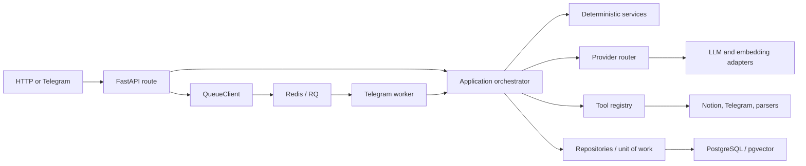

# LearnLoop Agent Design Overview

## Purpose

LearnLoop Agent turns external learning material into durable, reviewable
knowledge in Notion. It reads existing Notion pages without editing them,
creates AI supplement proposals, waits for a human decision, and appends only
accepted content to the page's `AI Supplement Zone`.

The knowledge lifecycle is:

```text
Learning source
  -> extraction and normalization
  -> grounded proposal
  -> human review
  -> append-only Notion update
  -> target-page re-index
  -> grounded QA
```

The backend, not the LLM, owns identity, permissions, validation, state
transitions, retrieval eligibility, citations, and write safety.

## Product scope

Implemented source types are PDF, article URL, YouTube transcript, screenshot
OCR, and pasted chat text. The service exposes HTTP APIs and a Telegram
webhook. Telegram supports ingestion, grounded `/ask`, review actions, page
selection, indexing operations, cost/workflow inspection, readiness, and
knowledge statistics.

The MVP is local-only. PostgreSQL with pgvector stores durable application and
derived knowledge state; Redis and RQ provide optional background Telegram
processing. Notion remains the source of truth for page content. The service
does not continuously synchronize Notion.

## Ownership model

Notion has three relevant content classes:

| Content | Agent behavior |
| --- | --- |
| Original or manually created page content | Read-only |
| Existing AI supplement blocks | Read-only; never rewritten or deleted |
| New accepted supplement | Append-only under `AI Supplement Zone` |

Every AI write follows:

```text
Change Request -> Human Accept -> Append to AI Supplement Zone
```

The append includes a visible `change-request-<id>` identity. The writer uses
that identity for read-after-write verification and retry idempotency. Accepted
content is re-indexed before it becomes eligible for production QA.

See [Notion permissions](06-notion-permission-model.md) and
[Guardrails](03-guardrails.md) for the complete policy.

## Synchronization model

There are two sources of derived-state change:

1. A manual Notion edit is reconciled by an explicit full or page-scoped
   incremental sync.
2. An accepted agent append triggers target-page re-indexing in the accept
   workflow.

Page indexing prepares the complete current page snapshot, including blocks,
chunks, and vectors, before opening the replacement transaction. If preparation
fails, the previous page snapshot remains intact. A full index processes pages
sequentially; pages committed before a failed page remain available.

## Architecture summary



Routes validate transport contracts and map responses. Orchestrators
coordinate workflows. Services enforce deterministic rules. Providers isolate
LLM and embedding APIs. Tools isolate Notion, Telegram, OCR, and source
parsers. Repositories own PostgreSQL access, and `QueueClient` owns queue
access.

## Data lifecycle

The durable model contains:

- Notion page and block snapshots used to reconcile the source of truth.
- `knowledge_chunks` with chunk text, citation metadata, and optional vectors.
- Source documents with normalized text and a content hash.
- Change requests with proposal content, target identity, and review status.
- Workflow runs and Telegram update/idempotency records for safe replay and
  operational inspection.

Production retrieval includes only eligible Notion-derived chunks. Pending and
rejected proposals are never retrieved. A successful append followed by a
successful page re-index is required before accepted knowledge is searchable.

## Architectural constraints

- Routes and orchestrators do not call provider SDKs, Notion, Redis,
  PostgreSQL, or other external APIs directly.
- LLM calls go through the provider router; external capabilities go through
  schema-friendly tools.
- PostgreSQL and Redis are infrastructure boundaries, not LLM-facing tools.
- Indexing fails closed if complete embeddings cannot be prepared.
- No direct original-note editing, always-on cloud sync, standalone MCP server,
  LangChain, LangGraph, reranker, or LLM-as-judge is part of the MVP.

See [Architecture](01-architecture.md), [Workflows](02-workflows.md), and the
[accepted decisions](decisions/) for implementation detail.
