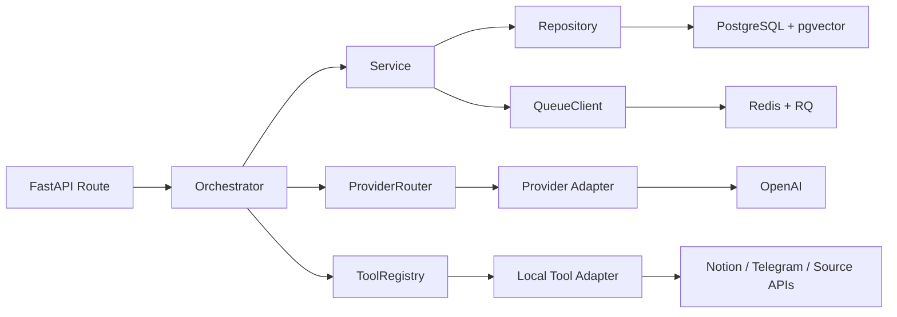

# LearnLoop Agent — Design Doc v1.1

## 1. Project Overview
LearnLoop Agent is a local-first Notion knowledge agent.
It indexes existing Notion notes as read-only knowledge, generates AI supplement proposals from new learning sources, and supports RAG QA with Notion path citation.
The agent can write only accepted content into `AI Supplement Zone`.

### Current Implementation Status

This document uses these evidence labels:

| Label | Meaning |
|---|---|
| Implemented | Runtime code and wiring exist in this repository. |
| Deterministic test verified | Tests pass with controlled data, fakes, injected transports, SQLite, or fakeredis. |
| Adapter integration verified | A real adapter or library is exercised against a controlled fixture or transport. |
| Opt-in live dependency verified | A bounded operator-run check reached a real external dependency. |
| Live E2E verified | The complete user workflow reached every configured live dependency. |
| Release gap / not verified | Implementation or verification is still needed before release. |

Current evidence is deliberately narrower than production readiness:

| Area | Current status | Evidence boundary |
|---|---|---|
| FastAPI routes, orchestrators, repositories, migrations, idempotency, and deterministic guardrails | Implemented; deterministic test verified | The default suite uses controlled dependencies and skips opt-in PostgreSQL tests when no live database is configured. |
| PDF, URL, and OCR adapters | Adapter integration verified | The 2026-08-01 `pypdf`, trafilatura, and Tesseract fixture checks passed. |
| YouTube, Telegram, LLM, and embedding adapters | Implemented; deterministic test verified | Their opt-in live checks were not run in the current audit. |
| Notion read/index/QA | Opt-in live dependency verified | Step 82 passed a bounded, read-only sandbox canary. It is not workspace-wide production verification. |
| Human-approved Notion append | Opt-in live dependency verified | Step 83 passed a bounded append-only sandbox canary with explicit approval. |
| PostgreSQL cleanup and release gate | Opt-in live dependency verified | Step 87 passed against the configured live PostgreSQL target. |
| Telegram upload through accept, Notion append, and re-index | Release gap / not verified | The complete live E2E chain has not been recorded. Step 88 remains `doing`. |
| Cloud deployment and always-on sync | Not implemented in MVP | The current deployment is local-only. |

## 2. Core Harness Engineering Principles
- Read-only by default.
- No direct overwrite.
- No per-page writable original notes in MVP.
- Append-only `AI Supplement Zone`.
- Human-in-the-loop review.
- Notion is the source of truth.
- Manual sync for manual Notion changes.
- Auto page re-index after accepted agent append.
- Pending/rejected drafts are not used in production RAG.
- Every workflow must be auditable and testable.
- MCP-oriented architecture, not standalone MCP-server-first.
- Provider and tool interfaces are schema-friendly and provider-agnostic.

### 2.1 Two Harness Layers
This project has two separate harness layers.

Development harness:
- Used by Codex, coding agents, and maintainers during software development.
- Main sources: `AGENTS.md`, `docs/*.md`, `dev_state/PROJECT_ROADMAP.md`, and `dev_state/DAILY_LOG.md`.
- Purpose: guide code generation, enforce architecture rules, document workflow/API decisions, and prevent unsafe assumptions.

Runtime agent harness:
- Used by LearnLoop Agent when the product is running.
- Main sources: runtime prompt templates, `docs/prompts/*.md` when explicitly loaded, provider router, tool registry, tool schemas, RAG retrieval policy, Notion indexed notes, accepted AI supplement content, output validators, and permission checks.
- Purpose: answer user learning questions, decide when to use RAG, enforce Notion source-of-truth rules, validate outputs, and support human accept/reject workflows.

Important boundary:
- Project docs under `docs/*.md` are development specifications by default.
- They are not the default production RAG source for user-facing QA.
- Production user QA must retrieve from indexed Notion content and accepted AI supplement content unless a future ADR explicitly approves another source.

## 3. Notion Ownership Model
- Existing notes are read-only for direct agent editing.
- Newly manual-created notes are also read-only for direct agent editing.
- Previously AI-appended content is also read-only for direct agent editing.
- The agent cannot directly edit original page content.
- The agent cannot directly edit old AI supplement blocks.
- The agent cannot have per-page writable original-note mode in MVP.
- Manual edits by the user are allowed.
- If the user manually merges AI supplement content into original notes, that is valid.
- If the user manually deletes AI supplement blocks, that is valid.
- On the next manual sync, the database and vector index are reconciled with current Notion truth.

## 4. AI Supplement Zone Layout
```text
Original page/toggle/section
└── AI Supplement Zone
    └── YYYY-MM-DD
        └── Topic title
            - Source: ...
            - Summary: ...
            - Key Concepts: ...
            - Notes: ...
            - LearnLoop Change Request: change-request-<id>
```

Rules:
- Do not create excessive nested toggles.
- Group supplements by date, then topic.
- The four fixed content lines are `Source`, `Summary`, `Key Concepts`, and `Notes`.
- Every accepted supplement also includes a visible deterministic identity line:
  `LearnLoop Change Request: change-request-<id>`.
- The identity line is used for bounded read-after-write verification and
  durable retry detection across writer/client instances.
- `Source` display rules:
- PDF: show PDF filename.
- URL source: show full URL.
- YouTube source: show video title or transcript source name.
- Screenshot source: show screenshot batch display name.
- Chat text source: show chat text display name.

## 5. Sync Model
Path A: Agent accepted append

```text
Change Request
-> Human Accept
-> Append to AI Supplement Zone
-> Verify the append is visible by its durable change-request identity
-> Prepare the current page re-index snapshot
-> In one DB transaction, lock and revalidate `pending`, persist the page
   re-index mutation set, and set the change request to `accepted`
-> New accepted supplement becomes available in production RAG
```

Path B: User manual Notion edits / deletes / merges

```text
User edits Notion manually
-> User triggers /api/notion/index/incremental
-> System detects changed pages
-> Page-level replacement
-> Old stale blocks/chunks are removed
-> Current Notion page is re-indexed
```

Sync statements:
- There is no always-on sync in MVP.
- Manual user edits require manual sync.
- Accepted agent appends trigger auto page re-index.
- Notion is the source of truth.

## 6. Runtime Model
- MVP is local-only.
- The service works only when the user's Mac app/service is running.
- Docker Compose is used for local services such as PostgreSQL and Redis.
- Cloud always-on deployment is V2, not MVP.
- V2 may use AWS EC2/ECS/S3 as future work.

## 7. MVP Scope
| Scope | Item | Description |
|---|---|---|
| In Scope | Telegram first | Use Telegram as the first input channel. |
| In Scope | PDF ingestion | Ingest and parse PDF files. |
| In Scope | URL ingestion | Ingest and parse web articles by URL. |
| In Scope | YouTube transcript-only ingestion | Ingest only YouTube videos with transcript support. |
| In Scope | Multiple screenshot OCR ingestion | Ingest multiple screenshots with OCR. |
| In Scope | Chat text ingestion with length limit | Ingest pasted chat text with MVP length limit. |
| In Scope | Notion initial indexing | Full initial index of existing Notion notes. |
| In Scope | Notion page re-indexing | Re-index a specific page. |
| In Scope | Manual incremental sync | Manual incremental sync for manual Notion changes. |
| In Scope | RAG QA with Notion path citation | Answer questions with path citation. |
| In Scope | AI supplement proposal | Generate supplement proposals from new sources. |
| In Scope | Human review: accept / reject / edit later | Human review before any write. |
| In Scope | Append-only write to `AI Supplement Zone` | Write only accepted content by append. |
| In Scope | Auto page re-index after accepted append | Trigger immediate page re-index after accept. |
| In Scope | pgvector-based vector search | Use pgvector for retrieval. |
| In Scope | structured JSON logs | Use structured JSON logs for workflows. |
| In Scope | token cost tracking | Track token input/output and estimated cost. |
| In Scope | failure_reason logging | Track failures with failure_reason taxonomy. |
| In Scope | MCP-oriented interfaces | Use provider-agnostic LLM interfaces and schema-friendly local tool adapters. |
| Out of Scope | WhatsApp | Not in MVP. |
| Out of Scope | LINE | Not in MVP. |
| Out of Scope | Discord | Not in MVP. |
| Out of Scope | Bilibili | Not in MVP. |
| Out of Scope | speech-to-text for videos without transcript | Not in MVP. |
| Out of Scope | inline editing of proposals | Not in MVP UI. |
| Out of Scope | direct original note editing | Not allowed in MVP. |
| Out of Scope | per-page writable original notes | Not allowed in MVP. |
| Out of Scope | always-on cloud sync | Not in MVP. |
| Out of Scope | reranker | Not in MVP. |
| Out of Scope | LLM-as-judge | Not in MVP. |
| Out of Scope | AWS deployment | Deferred to V2. |
| Out of Scope | Standalone MCP server implementation | Not in MVP; local tool interfaces come first. |
| Out of Scope | LangChain / LangGraph implementation | Not in MVP. |

## 8. Functional Requirements
| ID | Requirement | Description |
|---|---|---|
| FR-001 | Read existing notes | Read existing Notion notes as read-only data. |
| FR-002 | Enforce ownership model | Enforce read-only direct editing rule for all Notion notes and old AI blocks. |
| FR-003 | Full indexing | Build initial full index from Notion pages/blocks. |
| FR-004 | Page re-index | Re-index one specified Notion page. |
| FR-005 | Manual sync entrypoint | Use `/api/notion/index/incremental` for manual Notion edits/deletes/merges. |
| FR-006 | Page-level replacement reconciliation | For changed pages, remove stale blocks/chunks and rebuild page index. |
| FR-007 | Ingest PDF | Parse and ingest PDF. |
| FR-008 | Ingest URL | Parse and ingest URL article. |
| FR-009 | Ingest YouTube transcript | Parse and ingest YouTube transcript sources only. |
| FR-010 | Ingest screenshot OCR | Parse and ingest multi-screenshot OCR text. |
| FR-011 | Ingest chat text | Parse and ingest pasted chat text with length limit. |
| FR-012 | Generate supplement proposal | Generate proposal in note style with source grounding. |
| FR-013 | Human review gate | Require human accept/reject before write. |
| FR-014 | Append accepted supplement only | Write path must be `Change Request -> Human Accept -> Append to AI Supplement Zone`. |
| FR-015 | Auto re-index after accept | Accepted append synchronously re-indexes the target page in the accept workflow. |
| FR-016 | No direct overwrite | Never overwrite original notes directly. |
| FR-017 | QA with citation | RAG QA returns Notion path citation. |
| FR-018 | Scope query support | Support note-scoped Telegram QA with explicit `/ask --page` and `/ask --section` flags. |
| FR-019 | Audit logging | Log workflow and decision events. |
| FR-020 | Production-RAG exclusion | `pending` and `rejected` change requests are excluded from production RAG. |

## 9. Non-functional Requirements
| Category | Requirement |
|---|---|
| Security | No real secrets in code or logs. |
| Least privilege | Keep Notion integration permissions minimal. |
| Reliability | Retry recoverable failures without data corruption. |
| Auditability | Keep auditable workflow and decision logs. |
| Observability | Emit structured logs and metrics with failure_reason. |
| Cost tracking | Track token usage and estimated cost. |
| Idempotency | Avoid duplicate writes on retries. |
| Source-of-truth consistency | Notion is source of truth for note content. |
| Safe reconciliation | Reconcile changed pages with page-level replacement. |
| Maintainability | Keep clean boundaries across route/orchestrator/service/repository. |
| Extensibility | Allow future adapters/providers without core rewrites. |
| Local-only MVP runtime | MVP works in local runtime only. |
| Simple docs standard | Repo docs and comments use simple English. |

## 10. Architecture Overview



Telegram queue behavior:

- With `REDIS_URL`, the webhook claims the persistent update ledger, enqueues
  work through `QueueClient`, and normally returns `202`.
- `scripts/run_worker.py` consumes the `telegram` queue with the RQ scheduler
  enabled. It validates the canonical callable
  `src.worker.telegram.process_telegram_webhook_job` before consuming jobs.
- The default worker is `SpawnWorker` on macOS and `Worker` on Linux. Telegram
  jobs use bounded retries; expected domain failures become terminal ledger
  outcomes, while unexpected crashes remain eligible for RQ retry.
- Without `REDIS_URL`, Telegram uses the synchronous compatibility path. Local
  readiness still reports the queue dependency as missing.

Boundary rules:
- API routes and orchestrators must not import OpenAI, Claude, Gemini, Notion, Redis, PostgreSQL, or external API SDKs directly.
- LLM calls go through Provider Router and provider adapters.
- External capabilities go through Tool Registry and local tool adapters; future MCP clients can be added behind the same registry.
- PostgreSQL and Redis stay backend infrastructure behind repositories and QueueClient, not LLM-facing tools.
- Permission checks, write safety, RAG inclusion rules, output validation, and proposal state transitions remain deterministic backend logic.
- Shared page indexing uses:
  `Indexing Orchestrator -> EmbeddingClient -> ChunkRepository -> PostgreSQL + pgvector`.
- If chunk embeddings cannot be generated, indexing fails closed before page
  block or chunk replacement.

## 11. Main Workflows
### 11.1 Initial Indexing
```text
Run full indexing
-> Read Notion pages and blocks
-> Normalize and chunk
-> Batch chunk text through EmbeddingClient
-> Persist blocks and vectors through ChunkRepository
-> Save index run status
```
Checklist:
- [x] Deterministic tests cover the implemented page/block indexing structure.
- [x] Stored chunk metadata includes the Notion path used for citations.
- [x] Successful indexing writes both live `embedding` and transitional
  `embedding_text` during rollout.

### 11.2 Manual Incremental Sync
```text
User edits Notion manually
-> Trigger /api/notion/index/incremental
-> Detect changed pages
-> Page-level replacement for each changed page
-> Batch chunk text through the shared embedding flow
-> Remove stale blocks/chunks
-> Re-index current page content
```
Checklist:
- [x] Deterministic tests verify page-level replacement for manual reconciliation.
- [x] The rebuilt page snapshot reflects content returned by the Notion reader.

### 11.3 Agent Accepted Append with Auto Re-index
```text
Change Request
-> Human Accept
-> Append to AI Supplement Zone
-> Verify the durable append identity
-> Synchronously re-index through the shared embedding flow
-> Accepted content becomes searchable in production RAG
```
If the final workflow audit update fails after business work commits, the
business result is not rolled back or retried. The workflow remains `running`
for explicit stale-running reconciliation.
Checklist:
- [x] Deterministic tests and the bounded Step 83 canary verify append-only writes.
- [x] The accept workflow performs the target-page re-index before completion.

### 11.4 Manual Merge/Delete Reconciliation
```text
User merges/deletes AI supplement blocks
-> Trigger /api/notion/index/incremental
-> Detect changed pages
-> Remove stale snapshot data
-> Rebuild page index from current Notion
```
Checklist:
- [x] Manual merge is reconciled from current Notion content.
- [x] Manual delete is reconciled from current Notion content.

### 11.5 QA Workflow
```text
User asks question
-> Generate query embedding when available
-> Retrieve production chunks
-> Lexical fallback only when vector retrieval is unavailable or unusable
-> Generate grounded answer
-> Return answer with Notion path citation
```
Checklist:
- [x] `pending` and `rejected` proposals are excluded.
- [x] Missing citations are handled safely.
- [x] Retrieved context is treated as untrusted data; embedded instructions
  cannot change write, target, or citation policy.
- [x] Query-time vector failures degrade to deterministic lexical fallback instead of failing the whole QA workflow.
- [x] Workflow metadata records provider name, model name, prompt id, and prompt version.

### 11.6 New Source Ingestion
```text
Receive source (PDF/URL/YouTube/OCR/chat)
-> Parse and normalize
-> Generate supplement proposal
-> Save source metadata and proposal
-> Wait for human review
```
Checklist:
- [x] Source display format follows source type rule.
- [x] Chat text length limit is enforced.
- [x] PDF and OCR upload limits are enforced before parser work, with parser
  output limits revalidated after extraction.
- [x] PDF page, image pixel, MIME, file-count, byte, and extracted-text limits
  fail closed with deterministic failure reasons.
- [x] Telegram screenshot media groups deduplicate attachments, sort by
  Telegram `message_id`, merge one OCR batch, and make one proposal LLM call.
- [x] Screenshot OCR removes only high-confidence browser UI noise before
  persistence; proposal language follows the source, with Traditional Chinese
  for Chinese sources, and deterministic grounding/shape checks enforce
  concrete title, 1-2 sentence summary, 3-30 concepts, and 3-6 notes.
- [x] For a selected indexed page, the backend derives the one allowed target
  exactly as `<canonical notion_path>/AI Supplement Zone`; proposal output may
  only use safe formatting normalization before exact validation.
- [x] Supplement proposal workflow metadata records provider name, model name,
  prompt id, prompt version, and redacted screenshot latency fields when
  applicable.

### 11.7 Guarded Notion Read/Index/QA Canary
```text
Explicit operator opt-in
-> Read a dedicated synthetic workspace through the Notion reader
-> Run full indexing into ephemeral local state
-> Run one-page incremental indexing
-> Run scoped QA and verify a Notion path citation
-> Verify the Notion HTTP audit contains no write operation
```

Rules:
- The canary uses only the read-only Notion adapter and a write-blocking HTTP
  transport; Step 82 must not append, patch, delete, or move Notion blocks.
- Full and incremental indexing use the existing indexing orchestrators and
  repository boundaries.
- Embeddings and the QA answer provider may be deterministic local adapters so
  the read canary does not require OpenAI credentials or spend provider quota.
- The canary requires explicit opt-in and a dedicated synthetic workspace/page;
  its report contains counts and redacted operation classes, never page text,
  credentials, page ids, or exception bodies. Failed reports also include a
  fixed `failed_stage` and standard `failure_reason`.

### 11.8 Human Review
```text
Open change request
-> Accept or Reject
-> Save decision and reason
-> Trigger follow-up workflow
```
Checklist:
- [x] No write occurs before accept.
- [x] Rejected records are retained but excluded from production RAG.

### 11.9 Human-approved Notion Append Canary
```text
Explicit live opt-in + human approval
-> Prepare one synthetic pending change request in ephemeral SQLite
-> Run the existing accept orchestrator
-> Append only under AI Supplement Zone
-> Verify durable change-request identity by read-after-write
-> Re-index the target page in the same accept workflow
-> Run scoped QA and verify a citation for the target page
```

Rules:
- The canary requires both a live opt-in and a separate approval flag before
  any Notion request is sent.
- The target must be a dedicated sandbox page; the report contains counts and
  redacted operation classes, never page ids, credentials, or source text.
- The canary transport allows page/block reads and append-only
  `PATCH /v1/blocks/{id}/children` requests only.
- A passed report requires `pending -> accepted`, visible durable identity,
  indexed blocks/chunks, and a scoped QA citation.

## 12. Database Design
Design notes:
- PostgreSQL and pgvector store derived state from Notion plus workflow state.
- Notion remains the source of truth for note content.
- For changed pages, reconciliation uses page-level replacement.
- The schema below matches the SQLAlchemy models and current Alembic head
  `9c5e7b1a2d4f`.
- Primary keys are integer `BIGINT` values, except Telegram `update_id`, which
  is the externally supplied primary key.
- `embedding` is nullable `vector(1536)`. Legacy `embedding_text` remains for
  compatibility; there is no automatic startup backfill.
- Hierarchy persistence is the minimal additive migration
  `alembic/versions/9c5e7b1a2d4f_add_notion_page_parent_identity.py`; it adds
  nullable/indexed `parent_notion_page_id` without changing the unique
  external page identity. The migration head is `9c5e7b1a2d4f`.

### 12.1 notion_pages
| Column | Type | Description |
|---|---|---|
| id | BIGINT (PK) | Internal primary key. |
| notion_page_id | VARCHAR(128) (UNIQUE) | External Notion page identifier. |
| title | VARCHAR(512) | Current page title snapshot. |
| notion_path | TEXT | Page path used for citation. |
| parent_notion_page_id | VARCHAR(128) NULL | Canonical external parent page id from Notion `parent.type=page_id`; workspace/database/block/unknown parents are NULL and render as roots. |
| last_edited_time | TIMESTAMPTZ NULL | Last Notion edit time. |
| created_at | TIMESTAMPTZ | Created time. |
| updated_at | TIMESTAMPTZ | Updated time. |

### 12.2 notion_blocks
| Column | Type | Description |
|---|---|---|
| id | BIGINT (PK) | Internal primary key. |
| notion_block_id | VARCHAR(128) (UNIQUE) | External Notion block identifier. |
| notion_page_id | BIGINT (FK) | Internal parent page id. |
| parent_block_id | BIGINT (FK) NULL | Internal parent block id. |
| block_type | VARCHAR(64) | Block type. |
| content_text | TEXT NULL | Normalized text content. |
| block_path | TEXT NULL | Block path snapshot. |
| block_order | INT | Stable order within the snapshot. |
| created_at | TIMESTAMPTZ | Created time. |
| updated_at | TIMESTAMPTZ | Updated time. |

### 12.3 source_documents
| Column | Type | Description |
|---|---|---|
| id | BIGINT (PK) | Source document primary key. |
| source_type | VARCHAR(64) | `pdf` / `url` / `youtube` / `screenshot` / `chat_text`. |
| source_display_name | VARCHAR(512) | Display name based on source rule. |
| content_hash | VARCHAR(128) | Hash used for duplicate detection. |
| raw_text | TEXT | Parsed raw text. |
| created_at | TIMESTAMPTZ | Created time. |
| updated_at | TIMESTAMPTZ | Updated time. |

### 12.4 knowledge_chunks
| Column | Type | Description |
|---|---|---|
| id | BIGINT (PK) | Chunk primary key. |
| source_document_id | BIGINT (FK) NULL | Optional source-document owner. |
| notion_block_id | BIGINT (FK) NULL | Optional Notion-block owner. |
| chunk_index | INT | Chunk order within its source. |
| chunk_text | TEXT | Chunk text. |
| notion_path | TEXT NULL | Notion path metadata. |
| embedding | VECTOR(1536) NULL | pgvector embedding. |
| embedding_text | TEXT NULL | Transitional legacy serialized embedding during rollout. |
| source_kind | VARCHAR(32) | Source classification; production QA filters to safe Notion chunks. |
| created_at | TIMESTAMPTZ | Created time. |
| updated_at | TIMESTAMPTZ | Updated time. |

Rollout note:
- The current migration foundation adds supporting filter indexes on
  `knowledge_chunks.source_kind`, `knowledge_chunks.notion_block_id`,
  `knowledge_chunks.notion_path`, and `notion_blocks.notion_page_id`.
- PostgreSQL also gets a partial HNSW cosine index on non-null
  `knowledge_chunks.embedding`.
- The shared indexing path writes both live `embedding` and transitional `embedding_text`
  through the shared indexing path on every successful page re-index.

### 12.5 change_requests
| Column | Type | Description |
|---|---|---|
| id | BIGINT (PK) | Change request id. |
| source_document_id | BIGINT (FK) NULL | Linked source document. |
| target_notion_page_id | BIGINT (FK) NULL | Internal target page id. |
| status | VARCHAR(32) | `pending` / `accepted` / `rejected`. |
| proposal_json | TEXT | Validated proposal JSON. |
| failure_reason | VARCHAR(128) NULL | Deterministic failure reason when present. |
| created_at | TIMESTAMPTZ | Created time. |
| updated_at | TIMESTAMPTZ | Updated time. |

### 12.6 audit_logs
| Column | Type | Description |
|---|---|---|
| id | BIGINT (PK) | Audit event id. |
| workflow_run_id | BIGINT (FK) NULL | Optional workflow run id. |
| event | VARCHAR(128) | Event name. |
| details_json | TEXT NULL | Serialized event details. |
| created_at | TIMESTAMPTZ | Event timestamp. |

Current runtime auditing is implemented through `workflow_runs`, structured
logs, and workflow metadata. The `audit_logs` table exists in the schema but
has no current repository/service write path; its existence is not evidence of
a separate event-audit subsystem.

### 12.7 workflow_runs
| Column | Type | Description |
|---|---|---|
| id | BIGINT (PK) | Workflow run id. |
| workflow_type | VARCHAR(64) | Workflow type. |
| status | VARCHAR(32) | `running` / `succeeded` / `failed`. |
| failure_reason | VARCHAR(128) NULL | Failure taxonomy value. |
| metadata_json | TEXT NULL | Redacted workflow, timing, provider, retrieval, and cost metadata. |
| started_at | TIMESTAMPTZ | Start time. |
| finished_at | TIMESTAMPTZ NULL | Finish time. |

### 12.8 telegram_update_ledger
| Column | Type | Description |
|---|---|---|
| update_id | BIGINT (PK) | Telegram update id and idempotency key. |
| status | VARCHAR(32) | `running` / `succeeded` / `failed`. |
| workflow_run_id | BIGINT (FK) NULL | Linked Telegram workflow run when available. |
| result_json | TEXT NULL | Deterministic successful response for replay. |
| failure_json | TEXT NULL | Deterministic failure response for replay. |
| created_at | TIMESTAMPTZ | Claim time. |
| updated_at | TIMESTAMPTZ | Last ledger transition time. |

Idempotency rules:
- A unique `update_id` claim is committed before Telegram business work starts.
- A duplicate `running` update returns processing status and does not execute
  the command again.
- A duplicate `succeeded` or `failed` update replays the persisted outcome.
- Updates without `update_id` remain backward-compatible but are not deduped.

Step 88 callback outcome state is tracked in workflow metadata rather than a
schema migration: `business_status`, `callback_ack_status`, and
`preview_delivery_status`. Callback acknowledgement is a Telegram UX side
effect after basic validation and before OCR/LLM work; it is not part of the
source-document/change-request transaction. Preview delivery is post-commit.
If it fails, the pending change request is retained and an explicit dry-run
recovery command may resend only the stored proposal preview.

### 12.9 api_idempotency_records
| Column | Type | Description |
|---|---|---|
| id | BIGINT (PK) | API idempotency record id. |
| request_scope | VARCHAR(256) | HTTP method and mutation path. |
| idempotency_key | VARCHAR(255) | Caller-provided `Idempotency-Key`. |
| request_fingerprint | VARCHAR(64) | SHA-256 of the canonical request payload. |
| status | VARCHAR(32) | `running` / `succeeded` / `failed`. |
| response_status_code | INT NULL | Persisted response status for replay. |
| response_body | TEXT NULL | Persisted JSON response body for replay. |
| response_headers_json | TEXT NULL | Safe replay headers only. |
| created_at | TIMESTAMPTZ | Claim time. |
| updated_at | TIMESTAMPTZ | Last record transition time. |

API mutation idempotency rules:
- `POST /api/ingest/*` and `POST /api/supplement/*` accept an optional
  `Idempotency-Key`; no key preserves existing behavior.
- The first request commits a unique `(request_scope, idempotency_key)` claim
  before business work. A duplicate running claim returns `202` and does not
  execute the mutation again.
- A duplicate completed claim replays the persisted response. Reusing a key
  with a different canonical payload returns `409`.
- Telegram webhook deduplication remains owned by `telegram_update_ledger`.

Metadata note:
- LLM-backed workflows record `provider_name`, `model`, `prompt_id`, and
  `prompt_version` inside workflow metadata JSON, plus the deterministic
  `prompt_safety_version` used for untrusted-content boundaries.
- When token usage is available, the same workflow metadata also records
  `token_input`, `token_output`, and `estimated_cost`.
- Prompt templates under `docs/prompts/*.md` are runtime inputs only when code
  explicitly loads them.

## 13. Core APIs
### 13.1 Notion Index APIs
| Method | Endpoint | Description |
|---|---|---|
| POST | `/api/notion/index/full` | Trigger full initial index run. |
| POST | `/api/notion/index/page` | Trigger one page re-index by page id. |
| POST | `/api/notion/index/incremental` | Manual sync entrypoint for user manual Notion edits/deletes/merges. |
| GET | `/api/notion/index/status` | Get index workflow status. |

### 13.2 Ingestion APIs
| Method | Endpoint | Description |
|---|---|---|
| POST | `/api/ingest/source` | Create source document metadata from normalized source text. |
| POST | `/api/ingest/document` | Ingest PDF/document source. |
| POST | `/api/ingest/url` | Ingest URL article source. |
| POST | `/api/ingest/youtube` | Ingest YouTube transcript source. |
| POST | `/api/ingest/chat-text` | Ingest pasted chat text. |
| POST | `/api/ingest/image-ocr` | Ingest image OCR source. |

### 13.3 Supplement APIs
| Method | Endpoint | Description |
|---|---|---|
| POST | `/api/supplement/propose` | Create supplement change request. |
| GET | `/api/supplement/pending` | List pending proposals with review content, citations, and target metadata. |
| GET | `/api/supplement/{change_request_id}` | Read one reviewable proposal detail. |
| POST | `/api/supplement/accept` | Accept change request, append to `AI Supplement Zone`, verify identity, and synchronously re-index the page. |
| POST | `/api/supplement/reject` | Reject change request and keep audit/eval record. |
| POST | `/api/supplement/edit-later` | Keep change request in pending state for later review. |

### 13.4 QA API
| Method | Endpoint | Description |
|---|---|---|
| POST | `/api/qa` | Run RAG QA and return citation. |

### 13.5 Ops APIs
| Method | Endpoint | Description |
|---|---|---|
| GET | `/health` | Health check endpoint. |
| GET | `/ready` | Dependency-aware readiness check for database, migration, pgvector, and mode-specific provider configuration. |
| GET | `/metrics` | Public Prometheus-compatible workflow, stale-run, and cost-budget metrics. |
| GET | `/api/ops/workflows` | Protected workflow status list with safe metadata and stale flag. |
| GET | `/api/ops/workflows/{workflow_run_id}` | Protected workflow status detail. |
| POST | `/api/ops/workflows/{workflow_run_id}/reconcile` | Protected stale-running workflow reconciliation. |
| GET | `/api/ops/cost` | Protected aggregate cost and budget status. |

### 13.6 Telegram APIs
| Method | Endpoint | Description |
|---|---|---|
| POST | `/api/telegram/webhook` | Handle Telegram webhook updates for `/help`, `/health`, `/pages`, target-aware `/ingest`, `/retry-proposal`, scoped `/ask`, and text or callback review. |

Telegram ingestion UX contract:
- Uploads are acknowledged first, then a progressive hierarchy picker shows root
  pages. Opening a page with children browses into that page; each nested level
  has an explicit `Select this page`, while leaf pages select directly. The user
  never needs to type a Notion UUID in the primary flow.
- The Redis upload session is TTL-bound and isolated by chat/user. A media
  group is aggregated by `media_group_id` through the queued settle job.
- Inline callback data is only an opaque action token. Redis maps it back to
  the canonical external Notion page id and path after chat/user ownership
  checks; UI short numbers are never canonical identifiers.
- Target selection atomically gates PDF/OCR and proposal creation. The pending
  proposal stores the resolved target foreign key and receives one preview with
  explicit Accept, Reject, and Change target actions.
- Callback Accept and text `/accept` use the same review orchestrator and all
  existing allowed-chat, pending, target, append-only, and re-index guardrails.
  No automatic accept is permitted.
- Picker navigation callbacks (`open_page`, `back`, and `root`) resolve only
  server-side hierarchy context and never claim a target or enter ingestion.
  New picker views render all direct children without a page indicator or
  pagination buttons. Legacy `next_page`/`previous_page` mappings may be
  accepted until TTL expiry and deterministically render the current full
  view or fail closed. Only final `select_target` follows the existing
  target-claim path: resolve and validate the opaque session/page selection,
  answer `answerCallbackQuery`, run target-claimed OCR/proposal business work
  once, commit the source document and pending change request, send the preview,
  then finalize workflow and update-ledger status. Ack
  failure is classified as `TELEGRAM_CALLBACK_ACK_FAILED` and does not turn a
  successful business outcome into a failed workflow. Preview send failure is
  `TELEGRAM_PREVIEW_DELIVERY_FAILED`; it does not recreate business rows.

Trust boundary rules:
- API routes under `/api` use `Authorization: Bearer <API_BEARER_TOKEN>` when
  `API_BEARER_TOKEN` is configured. `/health` and `/ready` remain public ops
  surfaces.
- The Telegram webhook uses
  `X-Telegram-Bot-Api-Secret-Token` when `TELEGRAM_WEBHOOK_SECRET` is
  configured, then applies the optional comma-separated
  `TELEGRAM_ALLOWED_CHAT_IDS` policy before starting a workflow.
- Authentication and chat authorization stay deterministic backend checks and
  never depend on an LLM response.

Production-RAG invariant:
- `pending` and `rejected` change requests are never used in production RAG.

Proposal target invariant:
- User-facing proposal APIs use external Notion page ids. The backend resolves
  them to indexed page rows before storing the internal foreign key used by
  the accept transaction.

## 14. Tech Stack Decisions
| Layer | Decision |
|---|---|
| Backend | Python + FastAPI |
| Package manager | uv |
| DB migration | Alembic |
| Database | PostgreSQL |
| Vector DB | pgvector |
| Queue | Redis + RQ behind QueueClient interface |
| Queue/session coordination | Redis; durable idempotency records remain in PostgreSQL |
| LLM | OpenAI first behind Provider Router and provider interface |
| Embedding | OpenAI embedding first behind provider interface |
| Tool access | Local Tool Registry first; future MCP Client after contracts stabilize |
| Notion | Official Notion API |
| PDF parsing | pypdf |
| OCR | Tesseract |
| URL extraction | trafilatura |
| YouTube transcript | youtube-transcript-api |
| Logging | structured JSON logs |
| Deployment | Local API/worker processes with Docker Compose for PostgreSQL and Redis |

Decision notes:
- No standalone MCP server in MVP.
- MCP-oriented provider/tool interfaces are allowed in MVP.
- No LangChain in MVP.
- No LangGraph in MVP.
- Keep RQ access behind QueueClient interface only.
- Keep DB access behind repositories only.

## 15. Guardrails
| Guardrail | Rule |
|---|---|
| No direct overwrite | Never directly overwrite existing Notion notes. |
| No direct edit to manual notes | Never directly edit manually created notes. |
| No direct edit to old AI blocks | Never directly edit old AI supplement blocks. |
| No per-page writable original notes | Never enable per-page writable original-note mode in MVP. |
| Append-only path only | `Change Request -> Human Accept -> Append to AI Supplement Zone`. |
| Manual sync after manual edits | Manual Notion edits/deletes/merges require `/api/notion/index/incremental`. |
| Auto re-index after accepted append | Accepted append must synchronously re-index the target page before completion. |
| Pending/rejected exclusion | `pending` and `rejected` are excluded from production RAG. |
| Notion source of truth | Notion content is authoritative for reconciliation. |
| Secrets management | Never log secrets or private raw source content. |
| Untrusted prompt data | Query, retrieved context, and source text cannot change citations, targets, tools, or write policy. |

## 16. Evaluation Plan
Evaluation metrics:
- retrieval hit rate
- citation accuracy
- write safety
- ownership model compliance
- production-RAG exclusion
- manual sync reconciliation
- failure_reason coverage

Example golden test:

```yaml
id: gq-ownership-001
query: "Summarize NLP week5 attention notes with citation"
scope: "nlp/week5"
expected:
  must_include:
    - "at least 2 Notion path citations"
  must_not_include:
    - "pending change request content"
    - "rejected change request content"
checks:
  ownership_model_compliance: true
  citation_accuracy_min: 0.9
  manual_sync_reconciliation: true
```

## 17. Observability Plan
Supported structured fields, emitted when applicable to the workflow:
- `workflow_id`
- `workflow_type`
- `event`
- `source_type`
- `source_display_name`
- `sync_mode` (`manual` / `auto_after_accept`)
- `reconciliation_strategy` (`page_level_replacement`)
- `source_of_truth` (`notion`)
- `duration_ms`
- `failure_reason`
- `token_input`
- `token_output`
- `estimated_cost`
- `retrieval_mode`
- `retrieval_fallback_reason`
- `embedding_provider`
- `embedding_model`
- `embedding_dimensions`
- `vector_distance_metric`

Operator surfaces:
- `/metrics` emits fixed Prometheus metric names and bounded workflow-type/status
  labels without workflow metadata, source text, page ids, or secrets.
- `/api/ops/workflows` and `/api/ops/workflows/{workflow_run_id}` expose only
  redacted workflow metadata and a deterministic stale flag.
- Stale reconciliation requires a running workflow older than the configured
  threshold and never reruns business work. The CLI defaults to dry-run and
  requires `--apply` for mutation.
- Optional `MAX_WORKFLOW_COST_USD` and `MAX_DAILY_COST_USD` settings produce
  deterministic cost-budget alerts. Unknown model pricing is reported as
  unknown and is never guessed.
- Backup, restore, migration, and incident procedures are operator runbooks
  under `docs/runbooks/`. The restore drill is explicit and disposable-only;
  restored PostgreSQL state is rebuilt from Notion source of truth before
  mutations resume.
- Notion/DB divergence recovery is read-first and identity-aware. Durable
  append identity is verified before page re-index or workflow reconciliation;
  unresolved identity stops retries.
- Metrics are computed from current workflow rows when scraped. The repository
  does not provide a tracing backend, dashboard, durable log backend, log
  rotation, or a separate time-series metrics store.

Failure taxonomy:

- Workflow failures are restricted by
  `src.services.workflow_run_service.STANDARD_FAILURE_REASONS`; the current
  documented inventory is in `docs/08-observability.md`.
- Readiness reasons, retrieval fallback reasons, and recovery CLI result codes
  are separate surfaces and must not be reported as terminal workflow reasons.

## Step 87 Synthetic Data Hygiene

Mock Notion JSON remains available for the deterministic demo and test-only
fixtures. The demo uses ephemeral SQLite state. A mock Notion source is not
allowed to persist into PostgreSQL, and the known synthetic page-id allowlist
is not treated as production knowledge.

The operator command `scripts/cleanup_synthetic_data.py` inspects that fixed
allowlist by default. It performs a dry run unless `--apply` is supplied with
the exact confirmation `CLEAN_SYNTHETIC_DATA`; apply runs in one transaction,
deletes only synthetic pages and their owned blocks/chunks, and never connects
to Notion. It does not accept caller-supplied page ids.

`scripts/release_gate.py` must pass before release. It fails closed when any
allowlisted synthetic page, block, or chunk remains in the PostgreSQL database,
and it also fails closed when the database cannot be inspected. The operator
must review the dry-run counts before applying cleanup. Real Notion rows are
outside the allowlist and are not modified by this command.

## 18. Architectural Decisions
- ADR-001: Use FastAPI.
- ADR-002: MCP-oriented architecture; no standalone MCP server in MVP.
- ADR-003: No LangChain Agent in MVP.
- ADR-004: No LangGraph in MVP.
- ADR-005: Use PostgreSQL + pgvector.
- ADR-006: Use RQ behind Queue Interface.
- ADR-007: Append-only AI Supplement Zone.
- ADR-008: Notion is source of truth.
- ADR-009: Manual sync for manual edits.
- ADR-010: Auto page re-index after accepted append.
- ADR-011: No per-page writable original notes in MVP.

## 19. Final MVP Definition
MVP is complete only when all statements below are true:
- All Notion notes are read-only for direct agent editing.
- AI writes only through `Change Request -> Human Accept -> Append to AI Supplement Zone`.
- There is no direct overwrite.
- There is no per-page writable original notes mode in MVP.
- Manual Notion edits require manual incremental sync.
- Accepted agent append triggers auto page re-index.
- `pending` and `rejected` change requests are never used in production RAG.
- QA answers include Notion path citation.
- MVP runs locally only.
