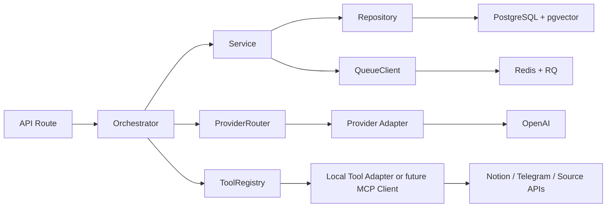

# 01 Architecture

## Purpose
This document defines the implemented system architecture and component boundaries.

## Status
Draft

### Current Implementation Status

The route, orchestrator, provider, tool, queue, repository, and adapter
boundaries below are implemented and deterministic test verified. Real Notion
read/index/QA and append have bounded opt-in live evidence from Steps 82 and
83. PostgreSQL cleanup/release gating has bounded Step 87 live evidence. Step
88 was subsequently user-confirmed as a completed guarded Telegram-to-Notion
live E2E. This is bounded live evidence and does not establish arbitrary
production-workspace readiness.

What belongs here:
- Layer boundaries and dependency rules.
- Runtime component diagram.
- Integration boundaries for Notion, LLM, queue, and storage.

## Core Layering
Primary request flow:



Provider flow:

```text
API Route
-> Orchestrator
-> Provider Router
-> Provider Adapter
-> OpenAI / Claude / Gemini
```

Tool flow:

```text
API Route
-> Orchestrator
-> Tool Registry
-> Local Tool Adapter or future MCP Client
-> Notion / RAG / Memory / External API
```

## MCP-Oriented Boundary
LearnLoop is MCP-oriented, not MCP-server-first.

MVP rules:
- Use local tool adapters behind a common Tool Registry.
- Keep tool input/output contracts schema-friendly.
- Do not add standalone MCP servers or MCP SDK dependencies in MVP.
- A future MCP Client can sit behind the Tool Registry after contracts stabilize.
- Extracting a tool into a real MCP server must not change orchestrator logic.

Provider rules:
- LLM calls go through Provider Router and provider adapters.
- OpenAI is the first provider.
- Claude and Gemini adapters must share the same orchestrator-facing interface.
- Orchestrators must not import provider SDKs directly.

Backend-owned deterministic logic:
- Permission checks.
- Notion write safety.
- RAG inclusion and exclusion rules.
- Output validation.
- Proposal state transitions.
- Audit logging decisions.

Proposal ownership boundary:
- The provider-output schema contains only generated content: `title`,
  `summary`, `concepts`, and `notes`.
- `source`, `target_path`, citations, source-document identity, attachment
  counts, and target identity are deterministic backend fields. The
  orchestrator builds `SupplementProposalSourceSchema` from the persisted
  `SourceDocument` and merges it with validated provider content before a
  change request is persisted.
- The provider boundary explicitly drops legacy backend-owned keys so an old
  model response cannot override them; all other unknown provider keys remain
  strict schema failures. The backend never parses a source display string to
  recover identity.

## Current Interface Skeletons (Implemented)
Provider boundary (Step 6.1):
- `src/providers/models.py`: `LLMMessage`, `LLMRequest`, `LLMResponse`.
- `src/providers/base.py`: `LLMProvider`.
- `src/providers/router.py`: `ProviderRouter` with deterministic registration and lookup errors.

Provider client implementation (Step 18):
- `src/providers/llm.py`: `BaseLLMClient`, `OpenAIClient`, and deterministic `LLMClientError`.
- `OpenAIClient` uses transport injection for deterministic tests and stays behind the provider interface.

Embedding provider implementation (Steps 14 and 50):
- `src/providers/embedding.py`: `EmbeddingClient`, `EmbeddingRequest`,
  `EmbeddingResponse`, and `OpenAIEmbeddingClient`.
- Indexing orchestrators depend on `EmbeddingClient`, not provider SDKs,
  and pass embedded chunk data to repositories only after provider success.

Large-page failure diagnostic boundary (Step 96):
- `src/observability/external_error.py` owns the fixed external HTTP category
  allowlist and retryability classification. It does not execute retries.
- The Notion and embedding transports retain only safe HTTP status, normalized
  category, retryability, and a bounded numeric `Retry-After` value. Raw
  upstream bodies and messages are discarded after in-memory classification.
- `EmbeddingRequestDiagnostics` contains only provider/model/dimensions,
  endpoint class, counts, and versioned size estimates. It never contains
  inputs, payloads, vectors, URLs, credentials, or Notion identity/content.
- The opt-in diagnostic command reads one page through `NotionReaderTool` with
  the diagnostic 30-second timeout and runs sequential single/small/progressive
  bounded provider probes under explicit request, byte, and token-estimate
  budgets without persistence.
  It does not add production batching, concurrency, retry, or retrieval logic.

Runtime prompt loading (Step 44):
- `src/services/prompt_template_loader.py`: loads versioned prompt bundles from
  `docs/prompts/*.md`.
- Orchestrators receive the prompt loader as a service dependency.
- Workflow metadata records `prompt_id` and `prompt_version` with provider/model
  metadata for LLM-backed workflows.

Tool boundary (Step 6.2):
- `src/tools/models.py`: `ToolSpec`, `ToolContext`, `ToolResult`, `ToolError`.
- `src/tools/base.py`: `Tool`.
- `src/tools/registry.py`: `ToolRegistry` with deterministic registration and lookup errors.

Orchestrator contract:
- Orchestrators call `ProviderRouter` and `ToolRegistry` only.
- Orchestrators do not import provider SDKs, Notion SDK, Redis clients, or DB drivers directly.
- Shared indexing uses:
  `NotionPageIndexOrchestrator -> EmbeddingClient -> ChunkRepository`.
- Semantic vector top-k retrieval uses:
  `ProductionChunkRetriever -> ChunkRepository -> PostgreSQL + pgvector`.

## Current Runtime Wiring and Readiness

The architecture sections in this document describe both implemented
boundaries and the target MVP integration shape. Current runtime wiring is:

- `get_tool_registry()` selects a shared Notion reader/writer backend from
  `NOTION_BACKEND=mock|live` (default `mock`). Mock mode uses the configured
  JSON page set for both clients. Live mode constructs the read-only and
  append-only REST adapters and requires `NOTION_TOKEN`; it never falls back
  to mock mode.
- `NotionFullIndexOrchestrator` discovers external Notion page ids through the
  reader tool, then reuses `NotionPageIndexOrchestrator` for each page's
  page-level replacement and embedding flow. `GET /api/notion/index/status`
  reads workflow state through `WorkflowRunService` and does not contact
  Notion.
- Real OpenAI LLM and embedding adapters are registered only when
  `OPENAI_API_KEY` is present. Shared page indexing requires the embedding
  adapter and fails closed when it is absent.
- PostgreSQL/pgvector repository paths and migrations are implemented. The
  Step 87 cleanup/release gate reached a live PostgreSQL target; the default
  suite still skips opt-in pgvector repository tests without a configured live
  database.
- `/health` remains a shallow liveness route. `/ready` calls the deterministic
  readiness service, which uses a database readiness probe for connectivity,
  Alembic revision, and pgvector extension checks plus mode-specific provider
  configuration checks.
- Telegram `/status` reuses that readiness service and exposes liveness
  separately from readiness. Its detailed checks are fixed safe states for
  database, migration, pgvector, provider, Notion configuration, Redis, and
  the RQ scheduler; it does not expose connection strings, credentials, or
  driver exception text.
- Telegram `/stats` uses `KnowledgeStatsService` and
  `KnowledgeStatsRepository` for aggregate page/block/chunk/vector/proposal
  counts and normalized UTC timestamps for the latest successful full index
  and manual incremental sync. It never reads or formats note content.
- `RQQueueClient` is wired behind `QueueClient` for Telegram webhook work when
  `REDIS_URL` is configured. The webhook claims the update ledger, enqueues a
  serializable job, and returns before ingestion, QA, review, or Telegram send
  work. `scripts/run_worker.py` consumes the `telegram` queue. Local
  compatibility without `REDIS_URL` keeps the previous synchronous path, while
  local readiness remains blocked until Redis is configured and reachable.
- API routes support a configured bearer-token boundary. Telegram webhook
  requests support a configured secret-token boundary and optional allowed-chat
  policy. Local/test compatibility remains available when these optional
  settings are absent; preflight reports the missing protections.
- `pypdf`, trafilatura, Tesseract, YouTube transcript, Telegram HTTP, Notion
  REST, and OpenAI adapters exist. Adapter-fixture tests do not prove the live
  services. The current host passes the Tesseract `eng`, `chi_tra`, and
  `chi_sim` preflight and adapter fixture. The user-confirmed guarded Step 88
  live E2E covers the Telegram path; this does not establish broader
  production-workspace or deployment readiness.

Remaining gaps and the next Telegram operator capability are tracked in the
`Telegram Operations + Knowledge Maintenance` phase of
`dev_state/PROJECT_ROADMAP.md`. They must use the existing provider, tool,
queue, repository, and deterministic policy boundaries.

## Real-Library Adapter Smoke Boundary

The Step 81 smoke matrix lives under `tests/evals/` and is an evaluation
entrypoint, not an API route or runtime orchestrator. It instantiates the
existing provider and tool adapters directly, injects controlled HTTP
transports for URL fixtures, and reports only fixed redacted statuses. It does
not bypass route/orchestrator boundaries in production code, does not write to
Notion, and keeps live dependency checks behind an explicit opt-in flag.

The Step 82 Notion canary is also an evaluation entrypoint. It wraps the real
read-only Notion REST adapter with a recording transport that permits only page
reads, block-child reads, and page discovery search. Any other operation is
blocked before network dispatch. Full index, incremental index, and QA still
run through the existing tool, orchestrator, repository, and provider
interfaces against ephemeral SQLite state.

Step 82 passed its bounded read-only live canary, and Step 83 separately passed
an explicitly approved append-only sandbox canary. These are opt-in live
dependency results, not production-workspace or complete Telegram E2E proof.

## Future MCP Server Boundary (Post-MVP)
Tools that may be extracted into MCP servers later:

| Local Adapter Family | Future MCP Server Candidate | Keep in Backend |
|---|---|---|
| Notion read access | Notion reader server | Permission checks and page ownership policy. |
| Notion write access | Notion append-only writer server | `AI Supplement Zone` write safety and accept-gate checks. |
| Ingestion adapters | PDF/OCR/URL/YouTube parser servers | Source validation, dedup policy, and workflow decisions. |
| Retrieval adapter | Vector search server facade | Production-RAG inclusion/exclusion and citation policy. |

Logic that must stay deterministic backend code (not MCP-owned):
- Permission checks and ownership model enforcement.
- Notion write safety (`Change Request -> Human Accept -> Append`).
- Production-RAG eligibility checks (`pending` and `rejected` exclusion).
- Output schema validation and failure_reason mapping.
- Change request state transitions and audit decisions.
- Queue scheduling policy and idempotency handling.

## Infrastructure Boundary
- PostgreSQL and pgvector are accessed only through repositories.
- Redis/RQ is accessed only through QueueClient.
- Raw PostgreSQL and Redis must not become LLM-facing tools.
- API routes must not directly call Notion, OpenAI, Claude, Gemini, Redis, PostgreSQL, or external APIs.
- Manual incremental sync and auto-after-accept re-index both reuse the same
  embedding-aware page indexing orchestrator instead of duplicating vector
  persistence logic in routes or review flows.
- pgvector distance ordering, NULL-vector exclusion, and filter-before-top-k
  behavior must stay inside repository queries rather than Python-side
  orchestrator ranking.
- Queue retry policy is deterministic and bounded at the enqueue boundary;
  expected Telegram/domain failures become terminal ledger outcomes, while
  unexpected worker crashes remain eligible for RQ retry.
- Upload resource policy is shared by API routes, ingestion orchestrators, and
  parser adapters. The route bounds bytes and metadata reads; orchestrators
  revalidate caller-independent limits; real PDF/OCR adapters enforce page,
  pixel, and extraction limits before expensive work.
- URL ingestion keeps outbound HTTP in the URL tool adapter. The adapter
  validates the scheme, rejects credentials and non-public IPv4/IPv6 targets,
  checks every DNS result before each request, follows only bounded redirects,
  and enforces response content-type and byte limits. These checks are
  deterministic backend policy and are not delegated to the LLM.
- Prompt safety keeps untrusted query, retrieved context, and source text
  formatting in a small service used by LLM orchestrators. Provider adapters
  receive the bounded prompt, while target resolution, citation construction,
  output validation, and Notion write policy remain deterministic backend
  responsibilities.
- The current schema contains `audit_logs`, but runtime workflow auditing uses
  `workflow_runs`, safe metadata, metrics, and structured logs. No repository
  or service currently writes the `audit_logs` table.

## Synthetic Data Boundary (Step 87)

The fixed synthetic-data policy is a neutral policy dependency used by the
indexing boundary and the repository-backed cleanup operator. When PostgreSQL
is selected, mock-source indexing and known synthetic page ids fail before
page, block, chunk, or vector persistence. Deterministic demos and evals use
ephemeral SQLite instead. The cleanup operator and release gate use repository
interfaces, never Notion clients or raw content output.
