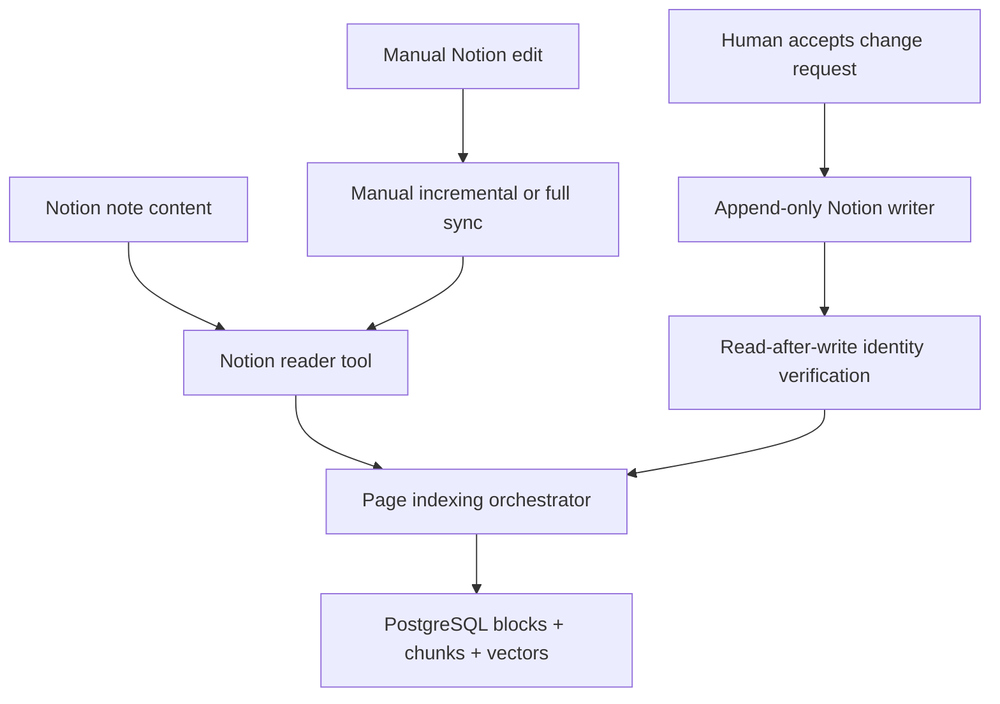

# 04 Memory Design

## Purpose

This document defines persisted knowledge, working state, retention, and
reconciliation for the local-first MVP.

## Status

Draft

### Current Implementation Status

The memory and synchronization paths below are implemented and deterministic
test verified. Steps 82 and 83 provide bounded opt-in live Notion evidence.
There is no always-on Notion sync, cloud memory service, or live E2E evidence
for the complete Telegram workflow.

## Memory Ownership

| Store | Current role | Authority and retention |
|---|---|---|
| Notion | Existing notes and accepted `AI Supplement Zone` content | Source of truth for note content. Manual edits, merges, and deletes win during reconciliation. |
| PostgreSQL | Page/block snapshots, chunks, vectors, sources, proposals, workflow state, and idempotency ledgers | Persistent local derived and workflow state. It must be rebuilt or reconciled from Notion after divergence or restore. |
| pgvector | Nullable `vector(1536)` values on knowledge chunks | Derived retrieval data, written through repositories. It is not a separate source of truth. |
| Redis | RQ jobs, Telegram upload sessions, callback tokens, and short-lived coordination | Ephemeral queue/session state behind `QueueClient` or the Telegram session-store interface. It is not production knowledge. |
| Runtime prompts | Versioned prompt templates loaded explicitly by code | Runtime inputs, not user knowledge and not included in production RAG by default. |

Private raw sources, credentials, callback payloads, and upload bytes must not
be copied into logs or workflow metadata.

## Production-RAG Eligibility

Production QA retrieves persisted Notion chunks only. The repository applies
the production-safe source filter before top-k retrieval and excludes known
synthetic ids. A source document or a `pending` or `rejected` proposal is not
production knowledge. An accepted proposal becomes eligible only after it is
visible in Notion and the current target-page snapshot has been re-indexed.

## Sync and Reconciliation

- Full indexing discovers accessible external page ids through the read-only
  tool and reuses the same page-indexing orchestrator for every page.
- Manual incremental sync accepts external Notion page ids and performs
  page-level replacement. Stale blocks and chunks for the page are removed in
  the same database transaction that stores the current snapshot.
- The page indexer reads and prepares the current Notion snapshot before the
  database mutation. A page-scoped PostgreSQL advisory transaction lock and
  `last_edited_time` comparison prevent an older snapshot from replacing a
  newer committed snapshot.
- Accepted appends use the visible identity `change-request-<id>`, bounded
  read-after-write verification, and synchronous target-page re-indexing.
- The Notion append and PostgreSQL transaction are not one cross-system atomic
  transaction. Recovery is read-first and identity-aware; an uncertain append
  must not be repeated until the identity is resolved.

## Workflow and Proposal State

- `workflow_runs` persists status, deterministic failure reason, and redacted
  metadata for indexing, ingestion, proposal, QA, review, and Telegram work.
- `source_documents` stores normalized source text and its content hash.
- `change_requests` stores validated proposal JSON and the deterministic
  `pending`, `accepted`, or `rejected` state.
- Accept/reject paths lock the change-request row and revalidate its state.
- `telegram_update_ledger` provides durable `update_id` replay behavior.
- `api_idempotency_records` protects supported ingestion and supplement POST
  requests when an `Idempotency-Key` is supplied.

## Retention and Recovery Boundaries

The MVP has no automatic retention scheduler or garbage collector for source,
proposal, workflow, or idempotency rows. Synthetic cleanup is an explicit,
fixed-allowlist PostgreSQL operator action. Backup and restore are also
operator-run. After a restore, current Notion content must be re-indexed before
mutations resume.

There is no automatic incident remediation, background Notion polling,
always-on cloud sync, or conflict-merging engine in MVP.
